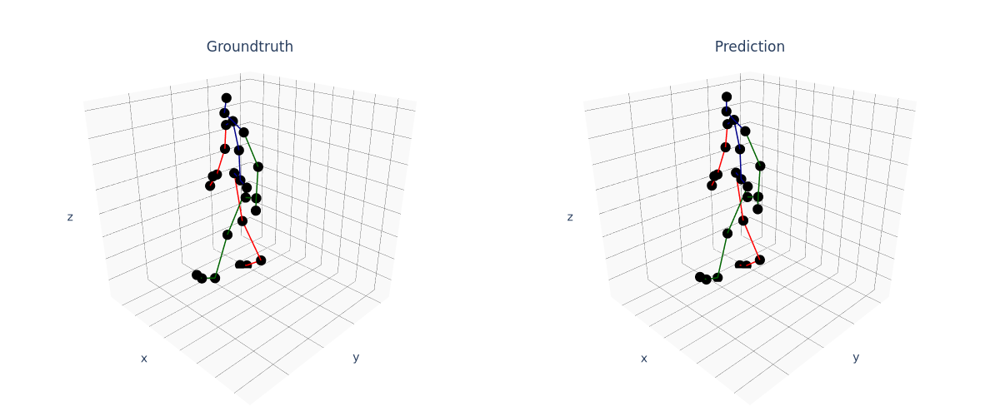
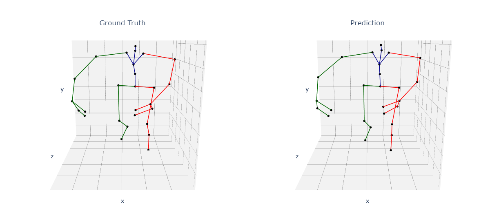

# Local and Global 3D Human Motion Prediction

This is the code repository for the paper [Long-Term Prediction of Local and Global Human Motion with Occlusion Recovery]() published on 20th International Symposium on Visual Computing (ISVC).

<div style="display:flex; gap:10px;">
  
  
</div>


## Installation

### Requirements
Developed with:
* [Python](https://python.org) 3.11
* [PyTorch](https://pytorch.org/get-started/locally/) 2.5

Further required packages are listed in [requirements.txt](./requirements.txt). They can be installed using pip:
```bash
pip install -r requirements.txt
```

## Usage
### Datasets

This repository supports the 
**Human3.6M** [[Paper](http://vision.imar.ro/human3.6m/pami-h36m.pdf), [Website](http://vision.imar.ro/human3.6m/description.php)], **AMASS** [[Paper](https://files.is.tue.mpg.de/black/papers/amass.pdf), [Website](https://amass.is.tue.mpg.de/)] and **HA4M** [[Paper](https://www.nature.com/articles/s41597-022-01843-z), [GitLab](https://baltig.cnr.it/ISP/ha4m)] datasets.

Information about:
1. How to set up the supported Datasets 
2. How to add your own Datasets

-> can be found [here](./docs/DATASETS.MD)

### Training
-Define the path to the dataset in [config.py](config.py).

-Call ``main`` function in [training.py](training.py)

```Python
import torch

from networks import NetworkType
from data import DatasetType
from util import RepresentationType

from training import main

main(
    # training with default parameters
    network_type=NetworkType.SPATIO_TEMPORAL,
    dataset_type=DatasetType.HUMAN36M,
    pose_representation=RepresentationType.CenterJDScale,
    loss_functions=[
        (1.0, torch.nn.L1Loss())
    ]
)
```
-`NetworkType.SPATIO_TEMPORAL` is the architecture introduced in the paper.

-`RepresentationType` defines how we represent the 3D skeletons and normalize the 3D motion sequences. Please see [pose_representation](./data/pose_representation/) and [pose_representation.py](./util/pose_representation.py).

-L1 loss was mainly deployed. [loss](./loss/) also provides cosine similatiry and geodesic loss, but unforturnately we have not seen improvements in performances if adding a secondary loss.


* Training with varying observation windows:

```Python
main(
    # ...
    # define observation windows range
    # f.e. 0.1-2.0 seconds
    vary_observation_windows_range=(0.1, 2.0)
)
```

* **Training with occlusions:**


```Python
main(
    # ...
    # enable training with occlusions
    training_with_occlusions=True
)
```


### Evaluation

The training will automatically create logs in a log directory under ``./logs``.

To inspect tensorboard logs run the following from terminal:
```bash
tensorboard --logdir logs
```
During the final evaluation of a model its results are also saved in a text file in the log directory called ``best_model_evaluation.txt``.

To manually load the snapshot of a model use the function ``load_model_snapshot`` in [./networks/\_\_init\_\_.py](./networks/__init__.py)

### Download our Trained Weights
|Dataset | Pose Representation | Architecture | Global or Local | Weight |
|:----|:----:|----:|:----|:----:|

## Extending this Repository

This repository features interfaces to add custom Metrics, Pose Representations and Training Loggers. For further information continue reading [here](docs/INTERFACES.MD).