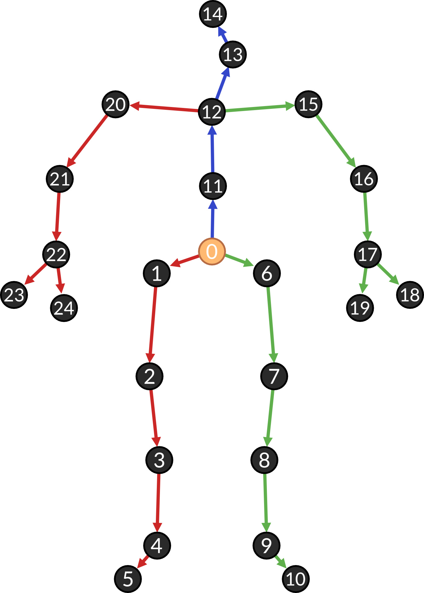
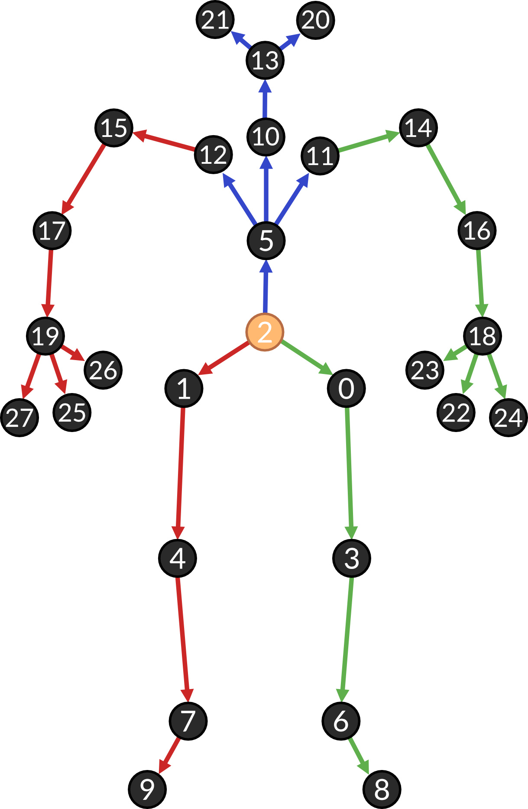
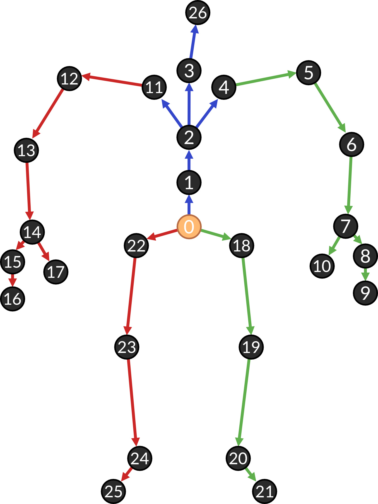

# Datasets

## Supported Datasets

The filepaths to all datasets that are used should be noted in [config.py](../config.py).

### Human3.6M [[Paper](http://vision.imar.ro/human3.6m/pami-h36m.pdf), [Website](http://vision.imar.ro/human3.6m/description.php)]

- Register for access at http://vision.imar.ro/human3.6m/description.php
- Download data: **By subject**/**Poses** for all subjects (S1, S5, S6, S7, S8, S9, S11)

The data should be organized as follows:
```
Human3.6M
└── poses
    ├── S1 
    │   └── D3_Positions
    │       ├── Directions 1.cdf
    │       ├── Directions.cdf
    │       ├── Discussion 1.cdf
    │       └── ...
    ├── S5
    │   └── D3_Positions
    │       └── ...
    ├── S6  ...
    ├── S7  ...
    ├── S8  ...
    ├── S9  ...
    └── S11 ...
```
When the Dataset is used for the first time it is preprocessed so that it can be loaded faster in the future.

The Human3.6M poses have the following pose linkage model:

<p align="center">
    
</p>

### AMASS [[Paper](https://files.is.tue.mpg.de/black/papers/amass.pdf), [Website](https://amass.is.tue.mpg.de/)]

Dataset:
- available after registration on [website](https://amass.is.tue.mpg.de/)
- download the `SMPL-X G` version of each dataset (not available for BMLHandball)

Body Model:
- the smplx pose model is required
- available after registration on [website](https://smpl-x.is.tue.mpg.de/)
- download SMPL-X model: `SMPL-X with removed head bun (NPZ, 392 MB)` 
- with note on the website: `"Use this for SMPL-X Python codebase and AMASS data"`

The data should be organized as follows:

```
AMASS
├── ACCAD
│   ├── Female1General_c3d
│   │   ├── A1_-_Stand_stageii.npz
│   │   ├── A2_-_Sway_stageii.npz
│   │   └── ...
│   ├── Female1Gestures_c3d
│   └── ...
├── BMLmovi
│   ├── Subject_1_F_MoSh
│   │   ├── Subject_1_F_1_stageii.npz
│   │   └── ...
│   └── ...
├── BMLrub
├── CMU
├── CNRS
└── ...
```

and the SMPL-X models in a seperate folder:
```
AMASS-models
└── models
    └── smplx
        ├── SMPLX_FEMALE.npz
        ├── SMPLX_MALE.npz
        └── SMPLX_NEUTRAL.npz
```
**Important:** The Dataset needs to be pre-processed before using it for the first time. Call ``python preprocess_amass.py`` after setting up the files and updating the entries in the [``config.py``](../config.py) .

The AMASS poses have the following pose linkage model:
<p align="center">
    
</p>

### HA4M [[Paper](https://www.nature.com/articles/s41597-022-01843-z), [GitLab](https://baltig.cnr.it/ISP/ha4m)]:

- Dataset is publicly available via link in the [GitLab repository](https://baltig.cnr.it/ISP/ha4m)
- Download the **Skeletons** folder and **labels.txt** for all sequences
- Do not add the Sequences with labels: ``IDU004V011``, ``IDU013V002``, ``IDU035V004`` and ``IDU035V005`` as they contain corrupted frames

The data should be organized as follows:
```
HA4M
├── IDU001V001
│   ├── Skeletons
│   │   └── 000124702712
│   │       ├── FrameID000000_DeviceTimeStamp450817733us.txt
│   │       ├── FrameID000001_DeviceTimeStamp450817733us.txt
│   │       └── ...
│   └── Labels.txt
├── IDU001V002
│   ├── Skeletons
│   │   └── ...
│   └── Labels.txt
├── IDU001V003
├── IDU001V004
├── IDU001V005
└── ...
```
When the Dataset is used for the first time it is preprocessed so that it can be loaded faster in the future. This process takes several minutes.

The HA4M poses have the following pose linkage model:
<p align="center">
    
</p>

## Add your own Dataset

To add your own dataset follow these steps:

1. Write a Python class for your dataset under ``data/your_dataset.py``
    - that implements the Base class ``MotionSequenceData`` defined in [data.py](../data/data.py)
    - implement a ``PoseLinkage`` for the dataset (f.e. refer to [human36m.py](../data/human36m.py))
2. Add your Dataset to the enum class in [data/\_\_init\_\_.py](../data/__init__.py)
3. Add your Dataset to the ``get_dataset`` util function in [util/data.py](../util/data.py), that will load the dataset for training

-> You can now use your Dataset by providing the training ``main`` function in [training.py](../training.py) with your own DatasetType enum and it will automatically be loaded using the util function.
